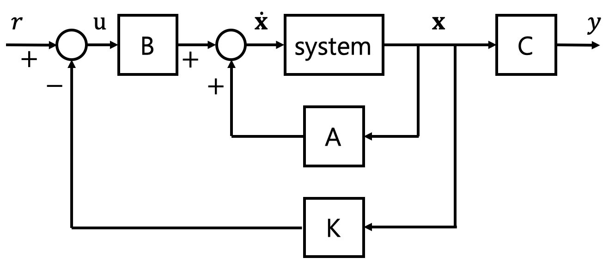
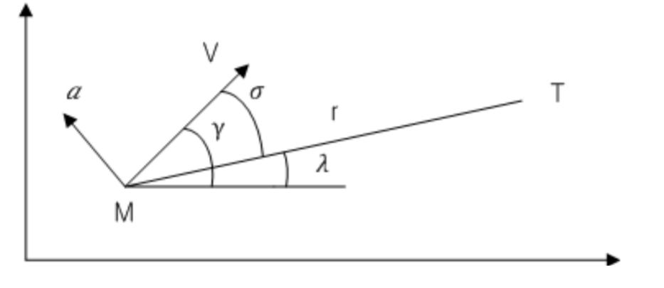
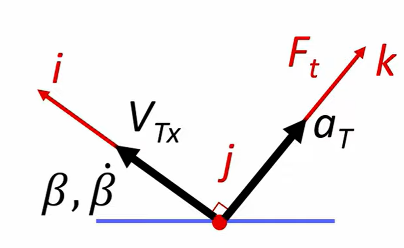
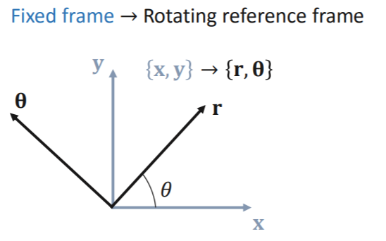
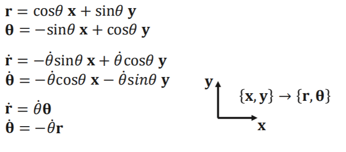

# 최적제어_유도 미사일

2021년 7월 2주차 LIG 넥스원 하계 현장실습 내용을 정리함

## Optimal Control ( 최적 제어 )

### 제어 이론

- 고전 제어 이론 (Conventional Control Theory) : 선형 시불변, 단일 입출력 시스템에 적용할 수 있는 이론

- 현대 제어 이론 (Modern Control Theory) : 선형과 비선형, 시불변과 시변인 다중입출력 시스템에 적용할 수 있는 이론

현대에는 **여러개의 입출력**을 가지는 시스템을 개발하고 시간에 따라 시스템의 변수가 변하는 **시변시스템**을 고려하기 시작했으므로 **현대 제어이론을 많이 활용** 

#### 상태방정식(State Space Equation)

- 현대 제어이론에서 시스템을 표현하기 위해 상태방정식을 사용

- 상태 방정식 
  $$
  \begin{align}
  \dot{x} = Ax + Bu
  \\y=Cx+Du
  
  \end{align}
  $$

  - 상태(State) : 어떤 시점(t=t0)에서의 변수를 알고, 시간이 지난 어느 시점(t >= t0)에서의 입력을 알면, 입력이 주어진 시점(t >= t0)에서 시스템의 거동을 완전히 결정할 수 있을 때, 이러한 변수(상태변수)들의 최소집합을 말한다. 
  - 상태 변수(State Variable) : 동적 시스템의 상태변수는 동적시스템의 상태를 결정할 수 있는 최소개수의 변수들
  - 상태벡터(State Vector) : 주어진 시스템의 거동을 표현하기 위해 n개의 상태변수가 필요하다면, 이 n개의 변수를 벡터x의 n개의 성분으로 생각할 수 있다. 이러한 벡터를 상태벡터라고 한다. 즉 상태를 벡터형태로 나타낸 것이다.
    - Computer는 고차 미분 방정식을 풀수 없으므로 일차 미분 방정식을 푸는 형태로 나타낸다.
  - 상태 공간(State space) : 좌표축이 x1, x2, ... xn 축으로 구성된 n차원의 공간을 상태공간(State Space)이라고 한다. 하나의 상태는 상태공간에서 한 점을 의미한다. 

- State space representation of mass-spring system

  

  - mass-spring system의 dynamics(동역학식)
    $$
    \begin{align}
    \sum F = ma \quad where \,\, a = \ddot{x}\\
    \sum F = F_a - kx = m \ddot{x}\\
    \therefore m \ddot{x} + kx = F_a
    
    \end{align}
    $$

  - dynamics -> state space
    $$
    \begin{align}
    x_1 = x \\
    \dot{x_1} = \dot{x} = x_2\\
    x_2 = \dot{x_1}=\dot{x}\\
    \dot{x_2} = \ddot{x}=-\frac{k}{m}x+\frac{1}{m}F_a
    \end{align}
    $$

  - 외부힘 F_a 를 제어입력 u로 생각한다.
    $$
    \begin{align}
    F_a = u
    \end{align}
    $$

  - State equations
    $$
    \begin{align}
    \dot{x} = Ax + Bu	\\
    y = Cx+Du\\
    \left[
    	\begin{matrix}
        	\dot{x_1}\\
        	\dot{x_2} \\
    	\end{matrix}
    \right]
    =
    \left[
    	\begin{matrix}
        	0 & 1\\
        	-\frac{k}{m} & 0 \\
    	\end{matrix}
    \right]
    \left[
    	\begin{matrix}
        	x_1\\
        	x_2\\
    	\end{matrix}
    \right]
    +
    \left[
    	\begin{matrix}
        	0\\
        	\frac{1}{m}\\
    	\end{matrix}
    \right]
    u\\
    y = \left[
    	\begin{matrix}
        	1 & 0\\
        	
    	\end{matrix}
    \right]
    \left[
    	\begin{matrix}
        	x_1\\
        	x_2\\
    	\end{matrix}
    \right]
    
    \end{align}
    $$

    - 제어입력 u를 잘 선택하면 위의 mass-spring system에서의 수레의 속도 및 가속도를 결정하여 수레를 원하는 위치로 이동시킬 수 있다는 것이다.

#### 제어 방법

시스템이 빠르고 정확하게 원하는 위치하도록 하는 제어 방법은 크게 Output feedback control과 State feedback control 이 있다. 

- Output feedback control

  Output feedback control은 현재의 상태를 센서로 측정하고, 이를 되먹임(feedback)하여 제어하는 방법이다. 우리가 가장 많이 사용하는 PID controller가 Output feedback controller에 해당한다.
  $$
  \begin{align}
  u(t) = K_pe + K_I\int e \, dt + K_D\dot{e} \\
  e(t) = r(t) - y(t)	\\
  \end{align}
  $$
  센서에서 측정한 현재의 상태 y(t)와 원하는 위치 r(t)와의 차이 e(t)와 e(t)를 적분 및 미분한 값에 각각 Kp, Ki, 그리고 Kd의 PID 게인을 곱하여 제어 입력으로 사용하는 방법

- State feedback control

  State feedback control은 말 그대로 시스템의 상태를 되먹임(feedback)하여 제어하는 방법이다

  

  시스템 모델(A, B)는 변하지 않는 값이기 때문에, 우리는 K를 적절히 결정해서 시스템이 어떤 속도와 가속도로 움직여야 할지 조절할 수 있다.

  

  Output feedback control : trial and error 방법 으로 K 구함

  State feedback control : 시스템 모델(A,B) 을 이용해서 K를 결정할 수 있음.

  **즉 ,모델만 정확하다면 optimal 한 K를 계산할 수 있어서 게인 값을 찾는데 드는 시간을 줄일 수 있다**

#### Hamiltonian System

##### The Least Action Principle - 최소 작용 원리

$$
S = \int^{t_2}_{t_1}\mathcal{L}(x,\dot{x},t)dt
$$

- 시간 t1 에서 t2 에서의 시스템의 동역학 상태가 각각 , A B 라고 하면 상태 A에서 B로의 진화는 다음 적분의 값이 최소가 되도록 진화

- 이 적분을 시스템의 작용 혹은 Action 이라고 정의하며 적분안의 라그랑지안은 경로에 따라 그 값이 달라지는 경로의 함수 이를 최소 작용 원리 , 혹은 해밀턴의 원리 

  

##### Hamiltonian 과 제어이론

- 상태방정식
  $$
  \dot{x}(t) = f(x(t),u(t),t)
  $$

- Performance Measure (cost function)
  $$
  J(u) = h(x(t_f),t_f)+\int^{t_f}_{t_0}g(x(t),u(t),t)dt
  $$

- Hamiltoian
  $$
  \mathcal{H}(x(t),u(t),\lambda,t) = g(x(t),u(t),t)\, + \lambda f(x(t),u(t),t)
  $$
  
- 상태방정식 조건 
  $$
  \dot{x}^*(t) = \frac{\partial\mathcal{H}}{\partial\lambda}(x(t),u(t),\lambda,t)
  $$
  
- 공상태 방정식 조건
  $$
  \dot{\lambda}^*(t) = -\frac{\partial\mathcal{H}}{\partial x}(x(t),u(t),\lambda,t)
  $$
  
- 최적 제어조건
  $$
  0 = -\frac{\partial\mathcal{H}}{\partial u}(x(t),u(t),\lambda,t)
  $$
  

  해당 이론은 최종적으로 Pontryagins's minimum(maximum) Principle 를 통해 완성된다.

##### Pontryagins’s minimum (maximum) Principle

최적 제어는 반드시, Hamiltonian을 최소(혹은 최대) 로 만드는 것

- Minimum Principle
  $$
  \mathcal{H}(x^*(t),u^*(t),\lambda^*,t) \leq \mathcal{H}(x^*(t),u(t),\lambda ^*,t)
  $$
  어떤 효용을 극대화 시키는 것으로 해석할 때 이렇게 된다.

**결론적으로** 아래의 식을 만족 시켜야한다.
$$
\frac{\partial \mathcal{H}}{\partial u}=0
$$

## 비례항법유도법칙 유도 

### 미사일과 목표물의 dynamics

- (1) 식의 유도

$$
\dot{r} = - V cos\sigma	\quad\cdots (1)
$$

​	

​	
$$
V^i_T =
\left[
	\begin{matrix}
    	-cos(\beta) & sin(\beta)\\
    	sin(\beta) & cos(\beta) \\
	\end{matrix}
	
\right]
\left[
	\begin{matrix}
    	V^t_{Tx}\\
    	0 \\
	\end{matrix}
	
\right]
$$
​	inertial coordinate system (관성 좌표계) 에서  Target Frame 으로의 회전변환 행렬을 내적하여 나타낸다.
$$
\begin{align}
V^i_{Tx} = -Vcos(\beta)\\
\dot{R}_{Tx}^i = V^i_{Tx}

\end{align}
$$

- (2)식의 유도
  $$
  \dot{\sigma} = \dot{\gamma}-\dot{\lambda} = \frac{a}{V}-\frac{V}{r}sin\sigma \quad\cdots(2)
  $$
  

  

  

- sigma 의 각을 작다고 가정하여 비선형 시스템을 선형시스템으로 바꾼다.
  $$
  \begin{align}
  \dot{r}=-V \\
  \dot{\sigma}=\frac{a}{V}-\frac{V}{r}
  
  \end{align}
  $$

### Cost Function & Hamiltonian 정의

- cost function

  입력 값 a 가 최소가 되는 것을 목표로 하기 때문에 cost Function은 아래의 식처럼 구성된다.

$$
J = 0.5\int^{t_f}_0 a^2 dt
$$

- Hamiltonian function
  $$
  H = 0.5 a^2 + p1 \times V - p2(\frac{a}{V}+\frac{V\sigma}{r}),(\sigma(t_f)=0)
  $$
  
- 결과
  $$
  a(t)=3(\frac{V\sigma(t)}{t_f-t}) = 3\dot{\sigma}(t)
  $$

